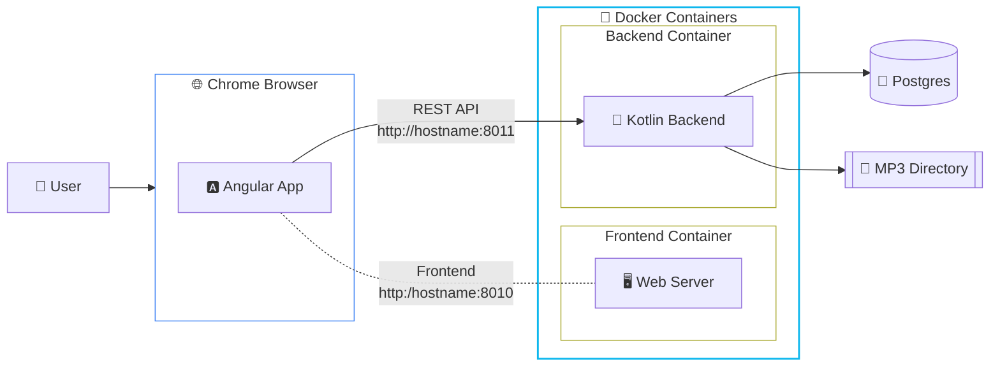

# Music-Spring Application

This project is a "full-stack" music management application with an Agnular frontend and a Spring Boot Kotlin backend.

You can use it to host your collection of mp3 music files.
Once you have imported your mp3 files you can organise your tracks into playlists.
You also have the ability to associate many other classifications such as Music Styles, 
Mood, Rating, etc. to your tracks. You can use the "Mixer" to combine tracks based on these
attributes to new playlists.

The tracks, playlists or groups can be played directly in the browser.

## Requirements

The app is designed around a backend. You can run this locally on your laptop, a home media server 
or you can rent a computer in a "cloud". In a local set-up I find "Docker Compose" does a good job. 
It can spin up the Frontend Container, the Backend Container and a Postgres Database container.

To use this app you need an open connection to the backend. If you are listening from your Laptop and serving
the app there that works fine. It will work just as well if you are in the same network and you are running
a "media server". If you leave that network, a VPN connection to that network can bridge the gap.

Kubernetes clusters will also work nicely. The thing to think through is the storage for the mp3 files.
If you are on Docker Compose you can mount a local directory as a volume into the backend container. 
If you are on K8S you can copy your mp3 files into the container or mount some sort of network shared
drive as a PVC into the container.

## Architecture Diagram



Architecture Notes

- The **Frontend** (port 8010) provides the user interface to browse, search, and manage playlists.
- The **Backend** (port 8011) handles music file scanning, metadata extraction, and provides the REST API.
- The **PostgreSQL** database stores track metadata and playlist information.


## Future enhancement ideas

- Download playlists as .m3u files with links to the tracks on the backend
- Download playlists with the mp3 files all in a .zip file
- Android app that connects to the back-end
- Ability to create playlists on an Android phone and download the files to phone for local playing

## Quick Start with Docker Compose

To get the application up and running quickly using Docker Compose, follow these steps:

### Prerequisites
- Docker needs to be installed on your host machine
- Think through the network connectivity from your browser to the containers
  Will you use `localhost` as the server name (which you can only reach from a browser 
  running on itsel) or does the host have a name associated with it's address? Which 
  ports are free and can the browser reach them (firewalls)?
- Where are the mp3 files? How much storage do they consume? They will need to be visible 
  on the `/mp3/` path in the backend container.

### Get the `docker-compose.yml file`

```bash
mkdir musicdatabase
cd musicdatabase
# Note doesn't work while the repo is in private mode
wget https://raw.githubusercontent.com/richardeigenmann/Music-Spring/main/docker-compose.yaml
```

### Customize `docker-compose.yaml`

Before running the application, you **must** update the `docker-compose.yaml` file with your specific configuration:

- **BACKEND_URL:** Where will the frontend container find the backend container? 
  You need to correct the `BACKEND_URL` in the `environment` section of the frontend.

- **Backend PORT:** On which port will the backend container be listening? This is declared in the line
  `- "8011:8002"` in the backend section. It means that whilst the Spring Boot Kotlin application is listening 
  on port 8002, Docker is exposing that as port 8011 on the host machine. The browser will be connecting to 
  this port to retrieve the playlists and the track data, so it has to be reachable throughout the network.
  If you want to use a different port, change it here and be sure to change it in the BACKEND_URL variable 
  discussed above.

- **APP_CORS_ALLOWED_ORIGINS:** The browser is started off by connecting to the frontend webserver but will quickly switch to 
  making REST requests from the backend container. The browser and Spring Boot will conspire to disallow this
  for security reasons unless you tell the backend container that requests that came from the Angular app
  running on the frontend URL are OK. That's what goes into the `APP_CORS_ALLOWED_ORIGINS`environment variable.

- **Paths:** Ensure the host paths that map to `/mp3` and `/admin` inside the backend container exist on your machine.
  Whatever directory you put to the left of the backend volume for `:/mp3` should have readable mp3 files.
  The directory to the left of the `:/admin` is where database backups will be stored.

- **Initial configuration** The `./config` path is for a `initial-data.yml` file that populates criteria in a blank
  database.

- **Database Credentials:** You should change the `POSTGRES_USER`, `POSTGRES_PASSWORD`, and `POSTGRES_DB` values.
  Make sure the corresponding `SPRING_DATASOURCE_*` variables in the `backend` service match.

### Start up the containers

In the root directory of the project, run:
```bash
docker compose up -d
```

If you do a `docker ps` you should see 3 containers: `music-frontend`, `music-backend`, `music-db`.

To kill them all and clean up everything do:

```bash
# kills the containers
docker kill music-frontend
docker kill music-backend
docker kill music-db 
# removes the containers
docker rm music-frontend
docker rm music-backend
# docker rm music-db # Think before you act!
# removes the container images
docker rmi richardeigenmann/musicfrontend:latest
docker rmi richardeigenmann/musicbackend:latest
docker rmi richardeigenmann/musicbackend:latest-native
docker rmi postgres:15
# They should all be gone:
docker ps
# remember to remove the directory you created and the docker-compose.yml file
```

### Access the Application

- **Frontend:** [http://octan:8010](http://octan:8010)
- **Backend API:** [http://octan:8011/api](http://octan:8011/api) (with Swagger at `/swagger-ui.html`)
- **Status page:** [http://octan:8010/status](http://octan:8010/status)

## Setting up the PgAdmin Database GUI

To start up the PgAdmin GUI to check up on the database ass the following to the `docker-compose.yml` 
file (before the `volumes:` section, remember to intent by 2 spaces):

```yaml
  pgadmin:
    image: dpage/pgadmin4
    container_name: music-pgadmin
    restart: unless-stopped
    environment:
      - PGADMIN_DEFAULT_EMAIL=admin@admin.com
      - PGADMIN_DEFAULT_PASSWORD=adminpass
    ports:
      - "8012:80"
    depends_on:
      - db
```

And then start all of them up:

```bash
docker compose up -d
```

- **PgAdmin:** [http://octan:8012](http://octan:8012) Use the PGADMIN_DEFAULT_EMAIL and PGADMIN_DEFAULT_PASSWORD 
values to login.

Once the page has opened, right-click on the `Servers` icon and `Register` the database server. 
You can Name it `Music Database`. On the `Connection` tab you need to give it the name inside the docker compase network.
This is from the docker-compose.yml file where I named it `music-db`. Obviously the Username and Password are the
ones associated with the database as set up in the docker-compose.yml file.

One you have the server registered you can click on the Query Tool Workspace icon on the left margin and connect to
the Music Database.

Queries you can run:

```sql
select * from public.group_type
```

## Publishing a new version

If you are Richard, use the `pushDockerContainers` Gradle task in the `docker` group to publish new versions.
This sill call the `pushDockerFrontend` task and the `pushDockerBackend` tasks. These tasks will run other tasks
that read the `gradle.properties` file from where the `version` variable propagates.

The `bootBuildImage` task looks at the `gradle.properties` `native` property to decide if a slow GraalVM or faster Java 
Build should be done. The GraalVM build is much faster at runtime.


## Backend Technical Requirement
Ensure your backend image includes the PostgreSQL JDBC driver. If you're building it from the provided source, add the following dependency to `musicbackend/build.gradle`:
```gradle
runtimeOnly 'org.postgresql:postgresql'

docker compose up -d
```
