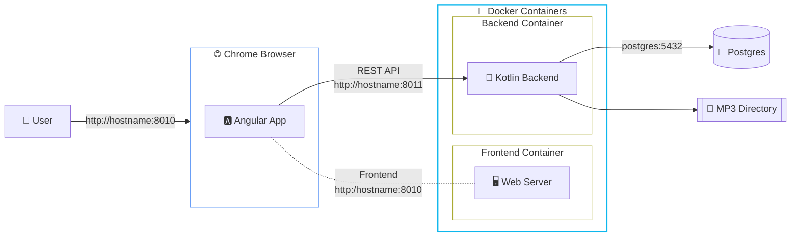
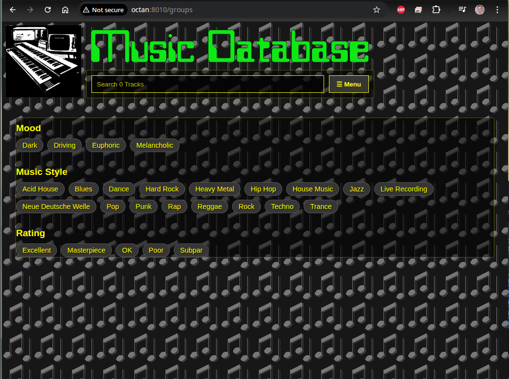
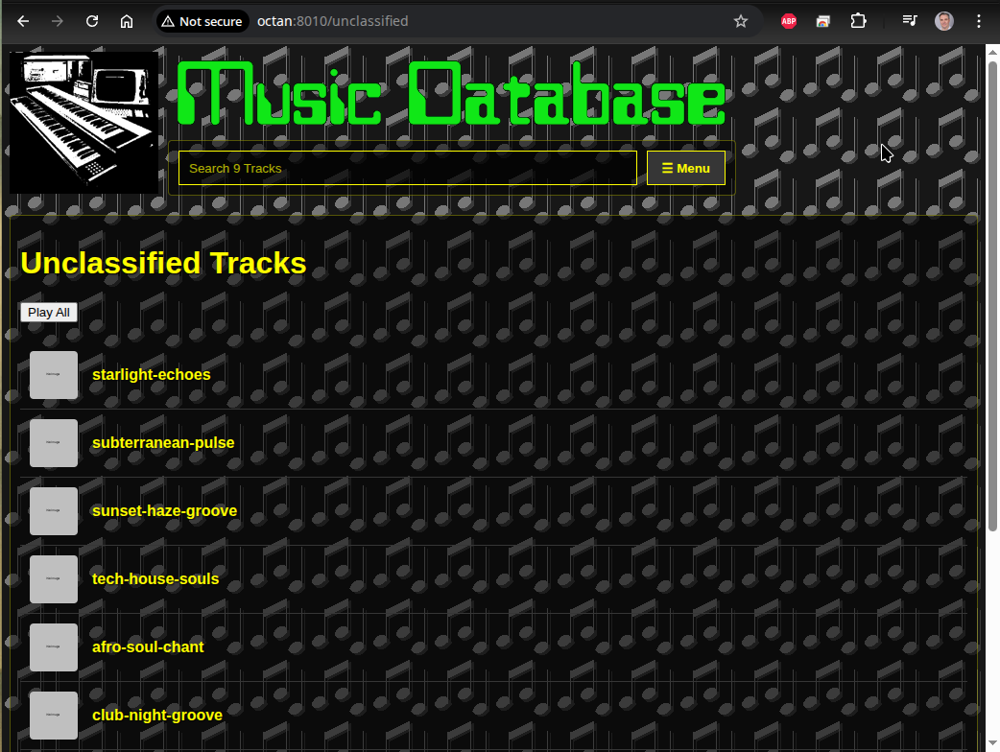
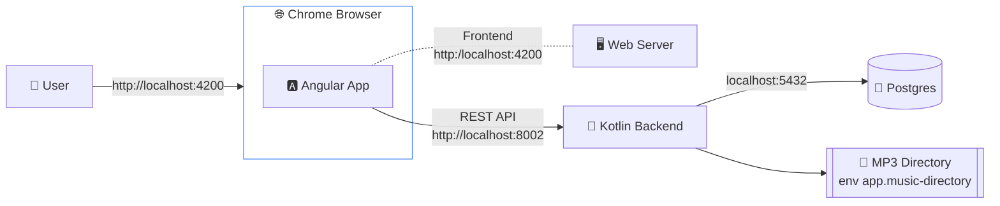

# Music-Spring Application

This project is a "full-stack" music management application with an Agnular frontend and a Spring Boot Kotlin backend.

You can use it to host your collection of mp3 music files.
Once you have imported your mp3 files you can organise your tracks into playlists.
You also have the ability to associate many other classifications such as Music Styles, 
Mood, Rating, etc. to your tracks. You can use the "Mixer" to combine tracks based on these
attributes to new playlists.

The tracks, playlists or groups can be played directly in the browser.

## Requirements

The app is designed around a backend. You can run this locally on your laptop, a home media server 
or you can rent a computer in a "cloud". In a local set-up I find "Docker Compose" does a good job. 
It can spin up the Frontend Container, the Backend Container and a Postgres Database container.

To use this app you need an open connection to the backend. If you are listening from your Laptop and serving
the app there that works fine. It will work just as well if you are in the same network and you are running
a "media server". If you leave that network, a VPN connection to that network can bridge the gap.

Kubernetes clusters will also work nicely. The thing to think through is the storage for the mp3 files.
If you are on Docker Compose you can mount a local directory as a volume into the backend container. 
If you are on K8S you can copy your mp3 files into the container or mount some sort of network shared
drive as a PVC into the container.

## Architecture Diagram



Architecture Notes

- The **Frontend** (port 8010) provides the user interface to browse, search, and manage playlists.
- The **Backend** (port 8011) handles music file scanning, metadata extraction, and provides the REST API.
- The **PostgreSQL** database stores track metadata and playlist information.

## Future enhancement ideas

- Android app that connects to the back-end
- Ability to create playlists on an Android phone and download the files to phone for local playing
- Cleaned up documentation
- An End 2 End testing script


## Quick Start with Docker Compose

To get the application up and running quickly using Docker Compose, follow these steps:

### Prerequisites
- Docker needs to be installed on your host machine
- Think through the network connectivity from your browser to the containers
  Will you use `localhost` as the server name (which you can only reach from a browser 
  running on itsel) or does the host have a name associated with it's address? Which 
  ports are free and can the browser reach them (firewalls)?
- Where are the mp3 files? How much storage do they consume? They will need to be visible 
  on the `/mp3/` path in the backend container.

### Get the `docker-compose.yml file`

```bash
mkdir musicdatabase
cd musicdatabase
# Note doesn't work while the repo is in private mode
wget https://raw.githubusercontent.com/richardeigenmann/Music-Spring/main/docker-compose.yaml
```

### Customize `docker-compose.yaml`

Before running the application, you **must** update the `docker-compose.yaml` file with your specific configuration:

- **BACKEND_URL:** Where will the frontend container find the backend container? 
  You need to correct the `BACKEND_URL` in the `environment` section of the frontend.

- **Backend PORT:** On which port will the backend container be listening? This is declared in the line
  `- "8011:8002"` in the backend section. It means that whilst the Spring Boot Kotlin application is listening 
  on port 8002, Docker is exposing that as port 8011 on the host machine. The browser will be connecting to 
  this port to retrieve the playlists and the track data, so it has to be reachable throughout the network.
  If you want to use a different port, change it here and be sure to change it in the BACKEND_URL variable 
  discussed above.

- **APP_CORS_ALLOWED_ORIGINS:** The browser is started off by connecting to the frontend webserver but will quickly switch to 
  making REST requests from the backend container. The browser and Spring Boot will conspire to disallow this
  for security reasons unless you tell the backend container that requests that came from the Angular app
  running on the frontend URL are OK. That's what goes into the `APP_CORS_ALLOWED_ORIGINS`environment variable.

- **Paths:** Ensure the host paths that map to `/mp3` and `/admin` inside the backend container exist on your machine.
  Whatever directory you put to the left of the backend volume for `:/mp3` should have readable mp3 files.
  The directory to the left of the `:/admin` is where database backups will be stored.

- **Initial configuration** The `./config` path is for a `initial-data.yml` file that populates criteria in a blank
  database.

- **Database Credentials:** You should change the `POSTGRES_USER`, `POSTGRES_PASSWORD`, and `POSTGRES_DB` values.
  Make sure the corresponding `SPRING_DATASOURCE_*` variables in the `backend` service match.

### Start up the containers

In the root directory of the project, run:
```bash
docker compose up -d
```

If you do a `docker ps` you should see 3 containers: `music-frontend`, `music-backend`, `music-db`.

To kill them all and clean up everything do:

```bash
# kills the containers
docker kill music-frontend
docker kill music-backend
docker kill music-db 
# removes the containers
docker rm music-frontend
docker rm music-backend
# docker rm music-db # Think before you act!
# removes the container images
docker rmi richardeigenmann/musicfrontend:latest
docker rmi richardeigenmann/musicbackend:latest
docker rmi richardeigenmann/musicbackend:latest-native
docker rmi postgres:15
# They should all be gone:
docker ps
# remember to remove the directory you created and the docker-compose.yml file
```

### Access the Application

- **Frontend:** [http://octan:8010](http://octan:8010)
- **Backend API:** [http://octan:8011/api](http://octan:8011/api) (with Swagger at `/swagger-ui.html`)
- **Status page:** [http://octan:8010/status](http://octan:8010/status)

## Setting up the PgAdmin Database GUI

The `docker-compose.yml` contains a section for the pgadmin container which is serves
a UI for the Postgres database. If you don't want this you can remove the ection from
the YAML file. (Don't remove the `volumes` section or Postgres won't persit anything 
between restarts.)
file (before the `volumes:` section, remember to intent by 2 spaces):

- **PgAdmin:** [http://octan:8012](http://octan:8012) Use the PGADMIN_DEFAULT_EMAIL and PGADMIN_DEFAULT_PASSWORD 
environment variable values from the `docker-compose.yml file` to login. Default values are: 
- `admin@admin.com` and `adminpass`

Once the page has opened, right-click on the `Servers` icon and `Register` the database server. 
You can Name it `Music Database`. On the `Connection` tab you need to give it the name inside the docker compase network.
This is from the docker-compose.yml file where I named it `music-db`. Obviously the Username and Password are the
ones associated with the database as set up in the docker-compose.yml file.

One you have the server registered you can click on the Query Tool Workspace icon on the left margin and connect to
the Music Database.

Queries you can run:

```sql
# Check the predefined classification types
select * from public.tag_type
  
# Check the available classifications:
select * from musicdatabase.tag

# remove all tables (including their content):
drop table musicdatabase.track_tag;
drop table musicdatabase.tag;
drop table musicdatabase.tag_type;
drop table musicdatabase.track_file;
drop table musicdatabase.track;         
```

## Using the application

After you spun up all the container successfully you have an empty music database.



Add music by hitting the Menu > Scan mp3 directoy.
If you need some tracks to get started check out this site with royalty fee house tracks:
https://elevenlabs.io/music/house

After importing your tracks it may look like this:



You can now click on the track icon to open the player at 
the bottom of the screen and play tracks individually or play the 
whole list.

If you click on the name of the track you open the 
editor window and can assign the Mood, Genre and Rating


## Publishing a new version

If you are Richard, use the `pushDockerContainers` Gradle task in the `docker` group to publish new versions.
This sill call the `pushDockerFrontend` task and the `pushDockerBackend` tasks. These tasks will run other tasks
that read the `gradle.properties` file from where the `version` variable propagates.

The `bootBuildImage` task looks at the `gradle.properties` `native` property to decide if a slow GraalVM or faster Java build should be done. The GraalVM build is much faster at runtime.

- check `gradle.properties`
- increment version number
- native build?
- run pushDockerContainers
- cd to directory where the `docker-compose.yml? file is located
- run `docker compose up -d` to refresh the containers


## Running in development mode

The file `musicfrontend/src/app/apiservice.ts` defines the fallback URL for the backend. Change the
API_URL to the url where the backend is running.

Note that the CORS policy must allow the frontend to connect. If the backend is running from the 
container specify the frontend URL in the variable `APP_CORS_ALLOWED_ORIGINS` (additional ones with 
comma seperation).

If the backend is running from the `application:bootRunPg` task in Gradle then the CORS policy 
comes from `musicbackend/src/main/resources/application.properties` 
where you need to add the frontend URL to the `app.cors.allowed-origins` property.

You will also need to define where the directory with the mp3 files is located in the
`application-dev-pg.properties` file under the key `app.music-directory`.



Starting it all up

```bash

# Prerequisites: You need to have NodeJs and Angular 21 installed
su - # not sure: you may need to be root to install Angular globally.
npm install -g @angular/cli
npm install -g angular-cli-ghpages

# clone the GitHub repository
git clone https://github.com/richardeigenmann/Music-Spring
cd Music-Spring

# to list the folder structure
tree -I 'node_modules|coverage|dist|build|bin'


# start the Kotlin backend
./gradlew bootRunPg

# start the Angular frontend
cd musicfrontend
ng serve -o
```

Point your browser at http://localhost:4200

## CORS Configuration

When you deploy, you can override this property without changing the code. 
For example, if you deploy your Angular app to https://www.your-music-app.com, 
you would set an environment variable for the backend Spring Boot container:

`APP_CORS_ALLOWED-ORIGINS=https://www.your-music-app.com`

### Supporting Multiple Origins

If you have multiple origins, they can be comma-separated. The way the `CorsConfig.kt` is set up, Spring Boot will automatically handle a comma-separated list for you.
When you define the property in `application.properties` like this: 
`app.cors.allowed-origins=http://localhost:4200,https://your-app.com,https://staging.your-app.com`

The `@Value` annotation injects this into the `allowedOrigins: Array<String>`, and Spring automatically splits the comma-separated string into an array of individual origins. The `allowedOrigins(*allowedOrigins)` call then correctly registers each one.

## Running the tests

```bash
# How to run the frontend unit tests
cd musicfrontend
ng test

# the backend tests
./gradlew test

# Running end-to-end tests
cd musicfrontend
ng serve -o # ensure that the application is running on localhost:4200
npx cypress open
# Then click on "E2E Testing", pick a browser and "Start E2E Testing".
# Then look for the add-tracks.cy.js hypelink and click on it. The tests should run.
```

## Upgrading the frontend

```bash
cd musicfrontend
npm outdated
ng update
npm update
npx npm-check-updates -u
```

## Linting

```bash
cd musicfrontend
ng lint
```

# Notes from setting up the frontend on local OpenShift

```bash
# nuke the cluster like when not having spun it up for 30 days and the certificates expire:
# needs the "pull-secret" which I have in my home directory
crc delete -f && crc cleanup && crc setup && crc start

# crc does some "interesting" things with the network stack, binding to port 80 and 443 on localhost. 
# instead set up a br0 bridge:
sudo nmcli con add type bridge ifname br0 con-name br0
sudo nmcli con add type ethernet ifname eth0 con-name br0-slave master br0
sudo nmcli con up br0
crc config set network-mode system
# Re-run setup to apply the network changes
sudo mkdir -p /etc/NetworkManager/dnsmasq.d/
crc setup

crc start # boots the virtual machine with the OpenShift cluster
crc status
crc oc-env # shows the command to source the oc CLI set-up
eval $(crc oc-env) # sets up the PATH to oc
export PATH=$PATH:/usr/sbin # adds the getcap visibility 
crc console --credentials # lists the commands to login
oc login -u developer -p developer https://api.crc.testing:6443 --insecure-skip-tls-verify=true

# Create a new namespace/project
oc new-project music-database

oc create -f - <<EOF
kind: PersistentVolumeClaim
apiVersion: v1
metadata:
  name: music-data-pvc
spec:
  accessModes:
    - ReadWriteMany
  resources:
    requests:
      storage: 50Gi
EOF

# spin up a helper container with the PVC attached and use that to do the rsync
oc run rsync-helper --image=quay.io/openshift/origin-cli --overrides='
{
  "spec": {
    "securityContext": {
      "runAsNonRoot": true,
      "seccompProfile": { "type": "RuntimeDefault" }
    },
    "containers": [
      {
        "name": "helper",
        "image": "quay.io/openshift/origin-cli",
        "command": ["/bin/sh", "-c", "sleep 3600"],
        "volumeMounts": [{"name": "mp3", "mountPath": "/mp3"}],
        "securityContext": {
          "allowPrivilegeEscalation": false,
          "capabilities": { "drop": ["ALL"] }
        }
      }
    ],
    "volumes": [{"name": "mp3", "persistentVolumeClaim": {"claimName": "music-data-pvc"}}]
  }
}'

# Then 
oc rsync /richi/mp3/ rsync-helper:/mp3/

# Create a service for the frontend Pod to reach the backend Pod on http://music-backend:8002
oc create service clusterip music-backend --tcp=8002:8002
# Create a route to the backend from outside the container
oc expose svc/music-backend --port=8002
# Force the selectors to match the exact 'deployment' label and nothing else
oc patch svc music-backend -p '{"spec":{"selector":{"deployment":"music-backend","app":null}}}'


# Get the routes to the new endpoint:
oc get routes

# Deploy the image from Docker Hub
oc new-app --name=music-backend --image=docker.io/richardeigenmann/musicbackend:latest \
  -e APP_CORS_ALLOWED_ORIGINS="http://music-frontend-music-database.apps-crc.testing"

# Check that the endpoints are connected
oc get endpoints music-backend

# Connect the PVC to the backend container
oc set volume deployment/music-backend --add \
    --name=music-storage \
    --type=pvc \
    --claim-name=music-data-pvc \
    --mount-path=/mp3

# Set up the CORS policy (which restarts the pod)
oc set env deployment/music-backend \
    APP_CORS_ALLOWED_ORIGINS="http://music-frontend-music-database.apps-crc.testing"


# set up the frontend
oc new-app --docker-image=docker.io/richardeigenmann/musicfrontend:latest \
    --name=music-frontend \
    -e BACKEND_URL=http://music-backend-music-database.apps-crc.testing/ \
    -e PORT=4200

# set up and expose a service so we can reach the frontend
oc create service clusterip music-frontend --tcp=4200:4200
oc expose svc/music-frontend --port=4200
# Fix the Frontend Service
oc patch svc music-frontend -p '{"spec":{"selector":{"deployment":"music-frontend","app":null}}}'

# Check the endpoints:
oc get endpoints music-backend music-frontend


# you can connect to the frontend on http://music-frontend-music-database.apps-crc.testing/
# and you can hit the backend on http://music-backend-music-database.apps-crc.testing/


# Describe Volume Mounts
oc describe deployment music-app | grep -A 10 Volumes

# Need to do this as admin
crc console --credentials

# To run the helper:
oc run rsync-helper --image=quay.io/openshift/origin-cli -it --rm -- /bin/bash
oc exec rsync-helper -- du -sh /richi
oc exec rsync-helper -- ls /richi/mp3
oc delete pod rsync-helper --force --grace-period=0
```

## Database Notes

By default, the application uses an H2 in-memory database. 

**Security Warning:** In production or public-facing deployments, the H2 console should be disabled to prevent unauthorized database access.

### Disabling H2 Console
To disable the H2 console, set the following property in your `application.properties` or as an environment variable:

`SPRING_H2_CONSOLE_ENABLED=false`

In the provided `application.properties`, this is currently set to `false` by default.

