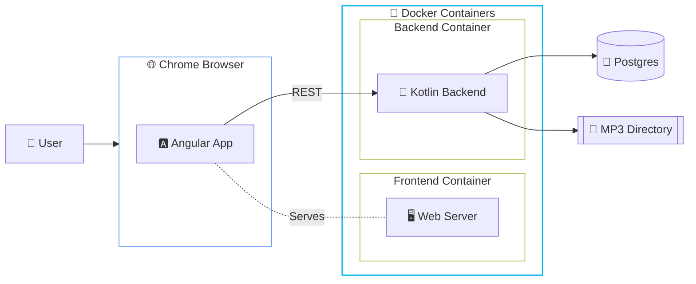

# Music-Spring Application

This project is a "full-stack" music management application with an Agnular frontend and a Spring Boot Kotlin backend.

You can use it to host your collection of mp3 music files.
Once you have imported your mp3 files you can organise your tracks into playlists.
You also have the ability to associate many other classifications such as Music Styles, 
Mood, Rating, etc. to your tracks. You can use the "Mixer" to combine tracks based on these
attributes to new playlists.

The tracks, playlists or groups can be played directly in the browser.

## Requirements

The app is designed around a backend. You can run this locally on your laptop, a home media server 
or you can rent a computer in a "cloud". In a local set-up I find "Docker Compose" does a good job. 
It can spin up the Frontend Container, the Backend Container and a Postgres Database container. 

Kubernetes clusters will also work nicely. The thing to think through is the storage for the mp3 files.
If you are on Docker Compose you can mount a local directory as a volume into the backend container. 
If you are on K8S you can copy your mp3 files into the container or mount some sort of network shared
drive as a PVC into the container.

## Architecture Diagram



## Quick Start with Docker Compose

To get the application up and running quickly using Docker Compose, follow these steps:

### 1. Prerequisites
- Docker and Docker Compose installed on your host machine.
- Your host machine should be accessible via its hostname (e.g., `octan`).

### 2. Customize `docker-compose.yaml`
Before running the application, you **must** update the `docker-compose.yaml` file with your specific configuration:

- **Image Names:** Update `image: richardeigenmann/musicbackend:latest` and `image: richardeigenmann/musicfrontend:latest` to point to your actual Docker Hub repository and image tags.
- **Hostname:** If your host's name is not `octan`, search and replace `octan` with your actual hostname in the environment variables:
  - `APP_CORS_ALLOWED_ORIGINS` for the `backend` service.
  - `BACKEND_URL` for the `frontend` service.
- **Paths:** Ensure the host paths `/richi/mp3` and `/richi/ToDo` exist on your machine and contain your music files. If they are in a different location, update the `volumes` section for the `backend` service.
- **Database Credentials:** You can change the `POSTGRES_USER`, `POSTGRES_PASSWORD`, and `POSTGRES_DB` values. Just make sure the corresponding `SPRING_DATASOURCE_*` variables in the `backend` service match.

### 3. Run the application
In the root directory of the project, run:
```bash
docker-compose up -d
```

### 4. Access the Application
- **Frontend:** [http://octan:8010](http://octan:8010)
- **Backend API:** [http://octan:8011/api](http://octan:8011/api) (with Swagger at `/swagger-ui.html`)

## Architecture Notes
- The **PostgreSQL** database stores track metadata and playlist information.
- The **Backend** (port 8011) handles music file scanning, metadata extraction, and provides the REST API.
- The **Frontend** (port 8010) provides the user interface to browse, search, and manage playlists.

## Backend Technical Requirement
Ensure your backend image includes the PostgreSQL JDBC driver. If you're building it from the provided source, add the following dependency to `musicbackend/build.gradle`:
```gradle
runtimeOnly 'org.postgresql:postgresql'

docker compose up -d
```
